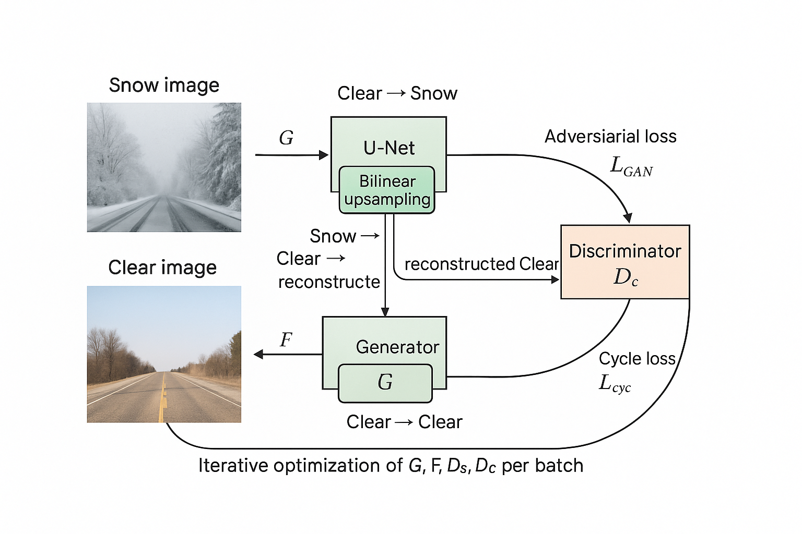

# Synth2Det: Loss‑Free Unpaired Adverse‑Weather Synthesis and Object‑Detection Enhancement for Autonomous Driving

## Project Overview

This is the 2025 Spring PolyU COMP4423 Computer Vision Project. This project addresses domain adaptation challenges in computer vision tasks across different weather conditions, specifically focusing on clear-to-snow transitions. It consists of two tasks:

1. **Task 1**: Weather Translation using CycleGAN
   - Implementation of CycleGAN to translate between clear and snowy weather conditions
   - Generated synthetic snow images while preserving scene content and structure

2. **Task 2**: Object Detection Domain Adaptation
   - Fine-tuning YOLOv11 object detector for improved performance in snowy conditions
   - Advanced adaptation strategies including synthetic data training and curriculum learning


## Repository Structure

```
Synth2Det/
├── Source Code/
│   ├── Task1_cycleGAN.ipynb           # CycleGAN implementation and training
│   ├── Task2_Yolo_datasets.ipynb      # Dataset preparation for object detection
│   ├── Task2_finetune+TTA.ipynb       # YOLO fine-tuning and test-time adaptation
│   └── requirements.txt               # Dependencies
├── assets/
│   ├── modified_cyclegan.png          # CycleGAN architecture diagram
│   ├── yolov11-strategies-final-clean.svg  # Fine-tuning pipeline visualization
│   ├── task1_result.png               # CycleGAN results visualization
│   └── task2_results.png              # YOLO detection results comparison
├── Datasets/                          # Datasets directory
│   └── declaration.md/                # The Google Drive links
├── Report/                            # Individual report for 
│   ├── 22097845d_YuhangDAI.pdf/       # DAI Yuhang's report
│   ├── 22102947d_ZhaoyuCUI.pdf/       # CUI Zhaoyu's report
│   └── 22098941d_TianyiZENG.pdf/      # ZENG Tianyi's report
├── README.md                          # Project documentation
└── report.pdf                         # Project report (not included in repository)
```

## Setup Instructions

### Environment Setup

1. Create a Python environment (Python 3.10 recommended):
   ```bash
   conda create -n comp4423 python=3.10
   conda activate comp4423
   ```

2. Install dependencies using the [`requirements.txt`](./Source%20Code/requirements.txt) file:
   ```bash
   pip install -r requirements.txt
   ```

### Dataset Availability

**IMPORTANT**: The datasets are not included in this repository. The notebooks contain code to automatically:
- Download datasets from Google Drive
- Extract and organize data into appropriate formats
- Prepare training/validation splits

### Running the Notebooks

1. Start Jupyter:
   ```bash
   jupyter notebook
   ```

2. Open each notebook and run cells sequentially
   - Ensure you have sufficient disk space for datasets (~5GB)
   - Task 1 requires a GPU with at least 8GB VRAM (Task1 is done in a single Nvidia L4 ) 
   - Task 2 ideally needs 24+ GB VRAM for default settings (Task2 is done in a single Nvidia RTX 4090)

3. For Task 2, the notebooks should be run in order:
   - First run [`Task2_Yolo_datasets.ipynb`](./Source%20Code/Task2_Yolo_datasets.ipynb) to prepare Yolo formed datasets
   - Then run [`Task2_finetune+TTA.ipynb`](./Source%20Code/Task2_finetune+TTA.ipynb) for model training (fine-tuning) and evaluation

## Important Links

### Dataset Links
- Task 1 (CycleGAN): [https://drive.google.com/drive/folders/1_gI7gD-5zA0Gl9IOnRV_jfgVz4zm-nej?usp=sharing](https://drive.google.com/drive/folders/1_gI7gD-5zA0Gl9IOnRV_jfgVz4zm-nej?usp=sharing)
- Task 2 (YOLOv11): [https://drive.google.com/uc?id=14qs3q589VUVorn5rfmSUBgcYtbzf8fmE](https://drive.google.com/uc?id=14qs3q589VUVorn5rfmSUBgcYtbzf8fmE)

### Model & Training Links
- GitHub Repository: [https://github.com/peterdai/COMP4423_Project](https://github.com/peterdai/COMP4423_Project)
- Task 1 Model (CycleGAN): [https://wandb.ai/22097845d-the-hong-kong-polytechnic-university/acdc-cyclegan?nw=nwuser22097845d](https://wandb.ai/22097845d-the-hong-kong-polytechnic-university/acdc-cyclegan?nw=nwuser22097845d)
- Task 2 Models (YOLOv11):
  - Baseline: [https://huggingface.co/Ultralytics/YOLO11/blob/5e0da476eb5def45e8080bd4b92ea63f0b16974c/yolo11m.pt](https://huggingface.co/Ultralytics/YOLO11/blob/5e0da476eb5def45e8080bd4b92ea63f0b16974c/yolo11m.pt)
  - Fine-tuning v1; [https://hub.ultralytics.com/models/sZgJJwYJ5KpXk2sZkAyW](https://hub.ultralytics.com/models/sZgJJwYJ5KpXk2sZkAyW)
  - 3-phased Fine-tuning v2: [https://hub.ultralytics.com/models/Gf7q1a77wr4Y9HS9RSWd](https://hub.ultralytics.com/models/Gf7q1a77wr4Y9HS9RSWd)

## Result Visualization

To visualize the results of the trained models, follow these steps:

### Task 1: CycleGAN Visualization
This is an example result with the real clear, real snow and synthesis snow driving conditions: 

### Task 2: YOLO Object Detection Visualization
This is the final result for four selected metrics on the same synthesis val datasets evaluated on baseline, finetunev1 and three phased finetunev2 
